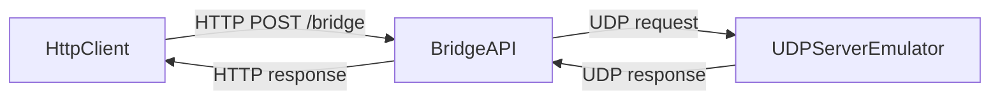
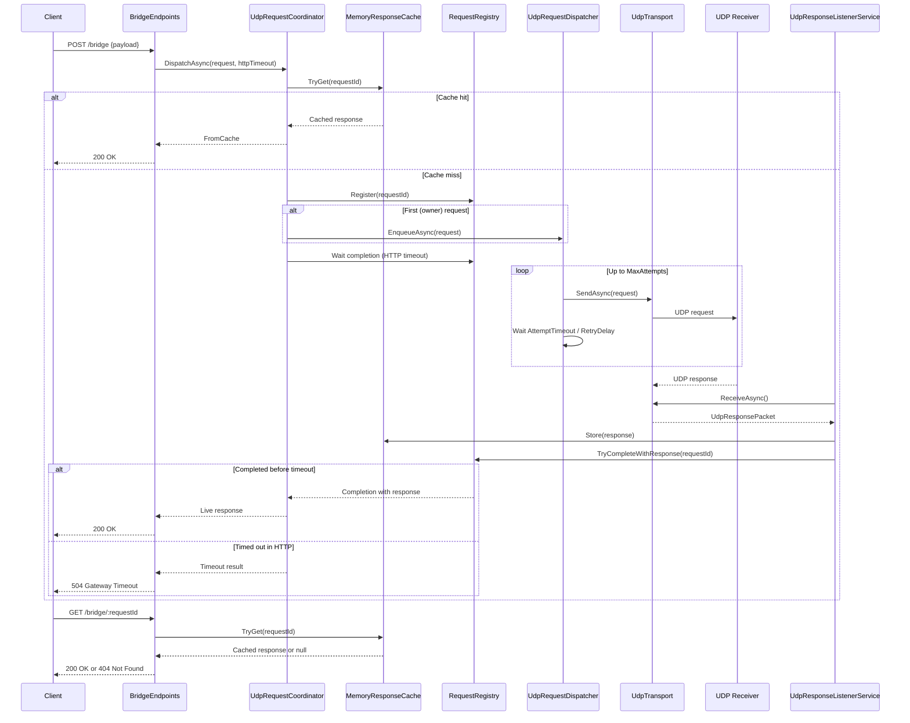

## HttpUDPBridge

`HttpUDPBridge` is a lightweight ASP.NET Core Web API that bridges HTTP requests to a half-duplex UDP receiver.

> ⚠️ Disclaimer  
> This is not a production-ready implementation.  
> The project was created purely for educational and demonstration purposes.

It includes:
- configurable UDP retry logic
- bounded in-memory dispatch queue (single worker)
- thread-safe pending request registry (`TaskCompletionSource` based)
- thread-safe in-memory response cache with TTL and background cleanup
- optional `X-Request-Id` support with deterministic payload-hash fallback
- `UDPServerEmulator` console app to test both apps in chain with random response delays

### Projects
- `src/HttpUdpBridge`: HTTP API
- `src/UDPServerEmulator`: test UDP receiver emulator
- `src/Abstractions`: core contracts
- `src/Models`: transport and orchestration models
- `src/Configuration`: options classes
- `src/Services`: coordinator, registry, queue dispatcher, background workers
- `src/Transport`: UDP transport implementation
- `src/Cache`: in-memory response cache

### Endpoints
- `POST /bridge`
- `GET /bridge/{requestId}`
- `GET /hc`

`POST /bridge` request body:

```json
{
  "payload": "ping"
}
```

Optional header:
- `X-Request-Id: <your-id>`

Response behavior:
- `200 OK` when response is available (live or cache)
- `504 Gateway Timeout` when HTTP wait timeout is exceeded
- late UDP responses are still cached and can be retrieved via `GET /bridge/{requestId}`

### Configuration

Main API config: `src/HttpUdpBridge/appsettings.json`
- `UdpEndpoint`: remote UDP target + local UDP bind port
- `UdpRetry`: attempt timeout, max attempts, retry delay, `QueueCapacity`
- `HttpBridge`: HTTP wait timeout + request id header name
- `ResponseCache`: TTL + cleanup interval

Emulator config: `src/UDPServerEmulator/appsettings.json`
- `ListenPort`
- `MinDelayMilliseconds`
- `MaxDelayMilliseconds`
- `ResponsePrefix`

### Run locally

1. Start emulator:
```bash
dotnet run --project src/UDPServerEmulator
```

2. Start API:
```bash
dotnet run --project src/HttpUdpBridge
```

3. Send request:
```bash
curl -X POST http://localhost:5030/bridge ^
  -H "Content-Type: application/json" ^
  -d "{\"payload\":\"hello\"}"
```

### Mermaid Diagram 1: Services Schema



### Mermaid Diagram 2: Sequence


